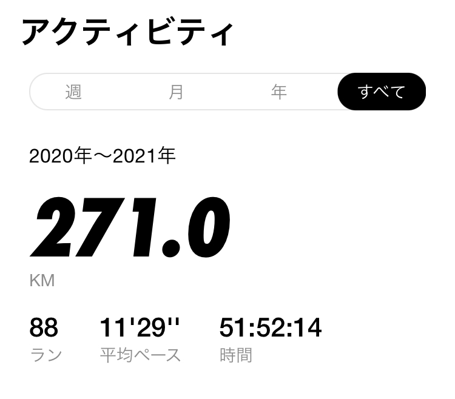

# 겨울 아침 운동 후 알게 된 것

## 달리기를 시작하다 👟
활기찬 일상을 보내고싶어서 체력을 길러야겠다고 다짐했다. 마침 집 주변에 달리기 좋은 강변이 있어서 쉽게 접근할 수 있는 `달리기`를 시작하기로 했다. 나는 달리기를 시작하면서 `Nike Run Club` 앱을 주로 사용했는데 이 앱은 사용자가 달리기를 하는 동안 다양한 데이터를 측정해준다.(달린 시간, 속도, 거리 등등) 이 데이터가 기록으로 저장되다보니 자연스레 이를 기록하는 재미로 달리기를 미약하게나마 즐길 수 있었고 달리고 난 뒤에 남은 기록을 인스타그램에 꾸준히 업로드 하면서 자그마한 성취감을 느끼기도 했다. 그러나 어느 순간부터 달리기 위해 밖으로 나가는 게 부담스럽게 느껴졌다.(사실 귀찮았던) 마침 학업에 있어서도 의욕을 잃어버린 터였는지라 자연스럽게 운동이란 운동은 그 시점으로 죄다 멈춰버렸다...
  

_(생각해보면 작년에만 총 250km 정도를 달리긴 했다. 1년차 러너에게 이정도면 나쁘지 않다고 생각한다..?😅 )_
   

## 유산소 운동을 다시 시작하게 되다. 🏃🏻
---
최근 다시 시간적 여유가 있는 날이 있으면 30~40분 정도 달리기를 시작했다. 건강해지고자 하는 목적도 있었지만, `'운동하는 사람'`이라는 정체성을 갖고싶었다. 스스로에 대한 자신감이 조금 부족한 때가 있었는데 어떻게든 이를 끌여올리지 않으면 더욱 기죽은 채로 생활하게 될 것 같다는 생각을 했다.매일 운동하지는 못하더라도 스스로를 운동하는 사람으로 느낀다면 좀 더 자신감을 가질 수 있을 것이라 생각했다.

... (내용 추가)

그러나 이상하게도 아침에 운동하는 것이 유달리 쉽지 않았다. 이른 시간에 일찍 일어나는 것이 부담이기도 하거니와 겨울 아침에 나가서 뛰면 얼마나 추울까싶었다. 게다가 한 번 뛰고 오는데에 1시간 정도 걸린다면, 안그래도 바쁜 아침 시간이 더욱 바빠질 것 같았다.

